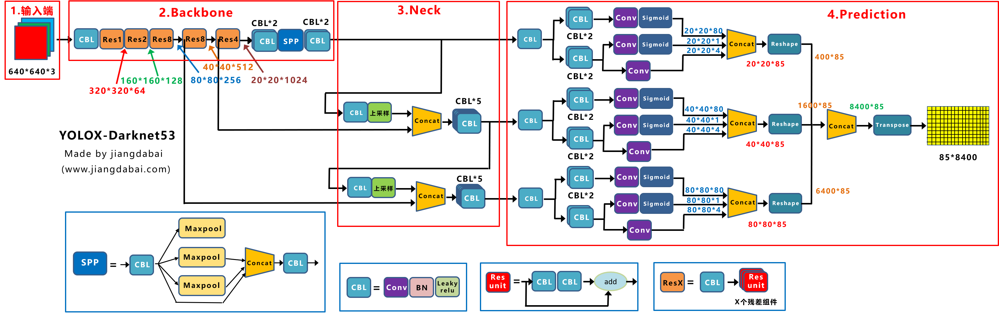

# YOLOX: Exceeding YOLO Series in 2021
总结：旷世科技的开源的anchor-free识别算法，基于YOLOV3改进，网络上增加了Decoupled head。使用了若干个训练技巧。这篇论文的大部分使用的技术都没有深入的介绍，所以如果需要深入的了解需要看其索引的论文和介绍相关技术的博客来学习。   
改进关键词：__Decoupled head__, __Strong data augmentation__, __Anchor-free__, __Multi positives__, __SimOTA__

参考博客（这个写的很好）：https://blog.csdn.net/nan355655600/article/details/119666304 在看完所有的相关论文后可以参考这个论文写一个综述。 

# 全部参考博客，这个写的没有博客写的好
# 以下未完成：

## 模型改进
### 1. Decoupled head
对于每一层FPN的特征，我们先使用一个$1*1$卷积把通道数变化到256，再使用两个平行的分支分别进行分类和回归任务。最后在回归分支中增加IoU分支。看博客讲的很详细。
### 2. AnchorFree 
使用Anchor需要预先对数据集做很多的分析，同时使用Anchor模型的泛化性会下降。这里介绍如何替换的没有看懂，可能需要知道yolov3和anchorfree在相关论文的其他知识才能理解。这里是原文：Switching YOLO to an anchor-free manner is quite simple. We reduce the predictions for each location from 3 to 1 and make them directly predict four values, ie., two offsets in terms of the left-top corner of the grid(yolov1的grid？？), and the height and width of the predicted box. 
### 3. Multi positives 没

## 训练改进
### 1. Mosaic 数据增强
来自于yolov3， 通过随机缩放，随机裁剪，随机排布的方式进行拼接，对于小目标的检测效果提升明显。

### 2. MixUp 数据增强

## 实际训练trike
1. 使用了consine lr schedule。这个只是在之前听到过，第一次看到实际使用的项目。
2. 在训练的最后15个epoch，Mosaic和MixUp数据增强会被关闭。同时因为这个两个数据增强，使用ImageNet预训练会没有意义。

